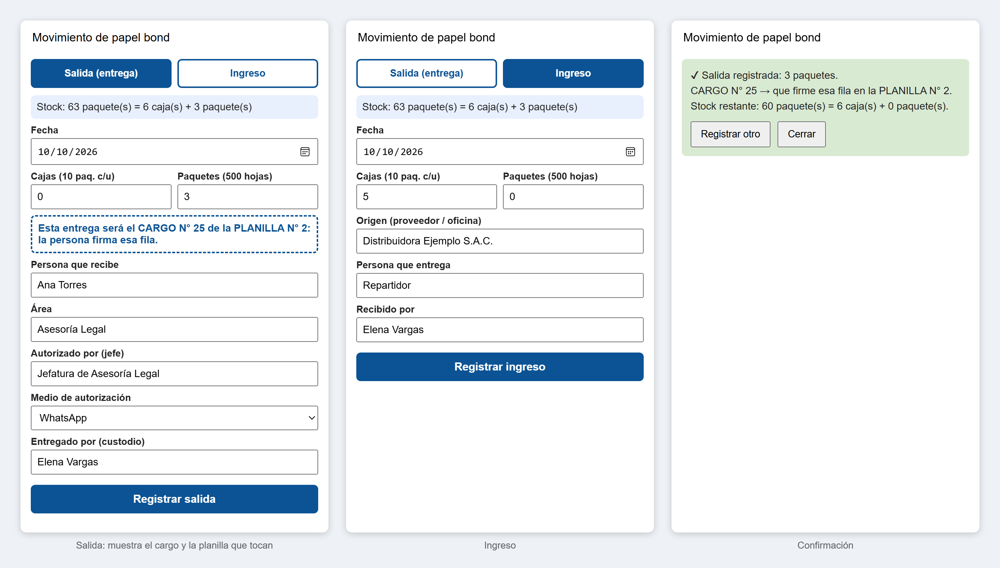
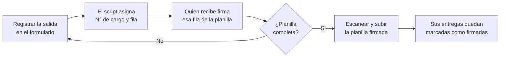
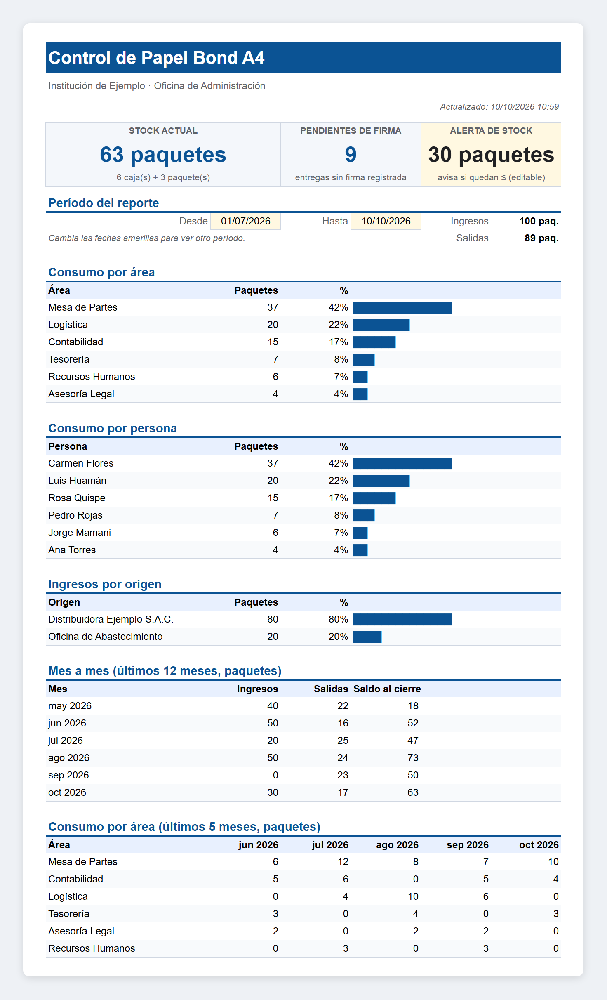
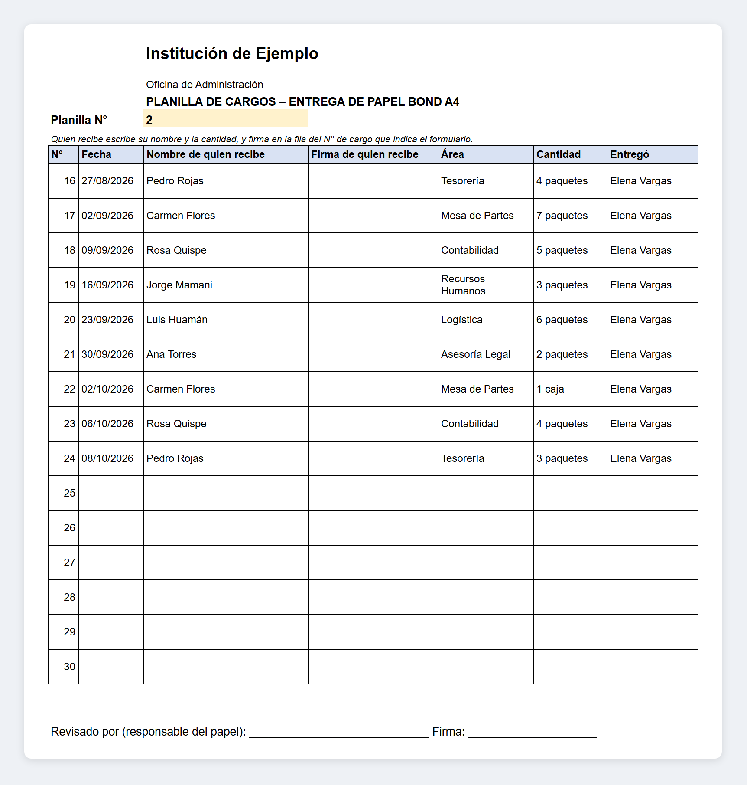

# Control de Papel Bond

[](https://github.com/ygallardops/control-papel-bond/actions/workflows/pruebas.yml)
[](LICENSE)


Herramienta para controlar el ingreso y la salida de papel bond A4 en una oficina, con cargo firmado por quien lo recibe.

Registra cada movimiento por cajas y paquetes, mantiene el stock al día y numera cada entrega en una planilla A4 de 15 filas para la firma. Funciona con Google Sheets y Apps Script, sin instalar software.

> [!NOTE]
> Recién implementado (octubre de 2026). No es un desarrollo oficial de ninguna institución.



Las capturas de este documento usan datos ficticios.

## Contenido

- [Cómo funciona](#cómo-funciona)
- [Qué hace](#qué-hace)
- [Hojas](#hojas)
- [Instalación](#instalación)
- [Uso](#uso)
- [Estructura](#estructura)
- [Pruebas](#pruebas)
- [Datos](#datos)
- [Licencia](#licencia)

## Cómo funciona

En lugar de un cargo por entrega, se imprime una hoja A4 cada 15 entregas (constante `FILAS_PLANILLA` de `Codigo.gs`).



1. Cada salida se registra en el formulario, que le asigna un N° de cargo y una fila en la planilla.
2. Quien recibe escribe su nombre y la cantidad, y firma esa fila en la planilla impresa.
3. Cuando la planilla completa sus filas, se escanea y se sube: sus entregas quedan marcadas como firmadas.

## Qué hace

- Registra ingresos (proveedor u otra oficina) y salidas (persona, área, quién autorizó y por qué medio) desde un formulario dentro de la hoja, que sugiere los nombres y áreas ya usados.
- Cuenta en cajas y paquetes: 1 caja = 10 paquetes de 500 hojas (constante `PAQ_POR_CAJA`). No admite hojas sueltas.
- Rechaza una salida mayor al stock disponible y evita cargos duplicados cuando registran varias personas a la vez.
- Muestra en el formulario, antes de registrar, el N° de cargo y la planilla que corresponden a la entrega.
- Genera la planilla en PDF A4 vertical, lista para imprimir y llenar a mano.
- Sube el escaneo de la planilla firmada a Drive y marca como firmadas sus entregas.
- Calcula reportes por período: consumo por área y por persona, ingresos por origen, mes a mes y por área en los últimos meses.
- Exporta el Resumen a PDF en Drive, en una hoja A4 vertical.
- Protege la hoja de movimientos con aviso ante ediciones manuales.

## Hojas

La configuración inicial crea tres hojas:

| Hoja | Contenido | Se edita a mano |
| --- | --- | --- |
| Resumen | Stock, pendientes de firma y reportes del período | Solo las celdas amarillas |
| Movimientos | Un registro por cada ingreso o salida | Solo para corregir errores |
| Planilla | Vista imprimible de 15 cargos | Solo el N° de planilla |

### Resumen

El script la redibuja tras cada registro o edición. Las celdas amarillas son la alerta de stock y las fechas del período.



### Planilla

Se imprime en blanco para llenarla a mano. En pantalla, cada fila se completa con lo registrado, lo que sirve para revisar o reimprimir.



## Instalación

1. Crear una hoja de Google Sheets en blanco con la cuenta que será propietaria.
2. En <kbd>Extensiones</kbd> → <kbd>Apps Script</kbd>, pegar [`src/Codigo.gs`](src/Codigo.gs) en `Código.gs` y crear un archivo HTML llamado `Formulario` con el contenido de [`src/Formulario.html`](src/Formulario.html).
3. Al inicio de `Codigo.gs`, configurar estos valores:

   | Constante | Uso |
   | --- | --- |
   | `INSTITUCION` | Nombre que aparece en el Resumen y en la planilla |
   | `OFICINA` | Oficina responsable del papel |
   | `MANUAL_URL` | Enlace a un manual de uso compartido (opcional) |

4. Recargar la hoja y ejecutar <kbd>Papel Bond</kbd> → <kbd>Configuración inicial</kbd>: pide el stock inicial en paquetes y crea las hojas.
5. Opcional: insertar el logo de la institución en la celda superior izquierda de la hoja Planilla.

<details>
<summary>Alternativa: subir el código con clasp</summary>

Con [clasp](https://github.com/google/clasp) instalado y la sesión iniciada, crear un `.clasp.json` con el ID del script y `"rootDir": "src"`, y luego:

```bash
clasp push
```

`.clasp.json` está en `.gitignore`: no se sube al repositorio.

</details>

<details>
<summary>Permisos que solicita el script</summary>

La primera vez, Google pide autorizar el script. Los necesita para:

- leer y escribir la hoja de cálculo;
- crear en Drive las carpetas de escaneos y de reportes, y guardar ahí los archivos;
- generar los PDF de la planilla y del Resumen;
- anotar el correo de quien registra cada movimiento.

</details>

## Uso

Todo se hace desde el menú <kbd>Papel Bond</kbd> de la hoja:

| Opción | Qué hace |
| --- | --- |
| Registrar movimiento | Abre el formulario de salida o ingreso |
| Ir a la planilla actual | Muestra la planilla que se está llenando |
| Imprimir planilla | Abre en PDF la planilla que muestra la hoja |
| Subir escaneo de planilla firmada | Guarda el escaneo (PDF o imagen, máx. 10 MB) en Drive y marca sus entregas como firmadas |
| Actualizar resumen | Redibuja la hoja Resumen |
| Exportar reporte a PDF | Guarda en Drive el Resumen del período elegido |
| Manual de uso | Abre el enlace configurado en `MANUAL_URL` |

> [!TIP]
> Los errores se corrigen editando la hoja Movimientos; el Resumen se actualiza después de cada edición.

## Estructura

```text
.
├── src
│   ├── Codigo.gs          Menú, registro, planilla, escaneos, reportes y configuración inicial
│   └── Formulario.html    Formulario de ingreso y salida
├── test
│   └── codigo.test.js     Pruebas de la lógica pura
└── docs                   Capturas de este documento
```

## Pruebas

Cubren la lógica pura: stock, cargos, planillas, cantidades y agregaciones de los reportes. Requieren Node.js (probado con la versión 24), sin dependencias:

```bash
node --test
```

GitHub Actions las ejecuta en cada push y pull request.

## Datos

Los movimientos, escaneos y reportes viven en la hoja y en el Drive de quien la usa; el repositorio no contiene datos.

> [!WARNING]
> Los escaneos de planillas firmadas llevan nombres y firmas: no deben subirse aquí.

## Licencia

[MIT](LICENSE)
